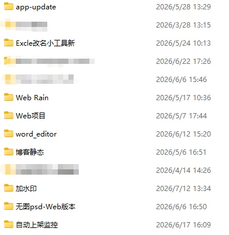
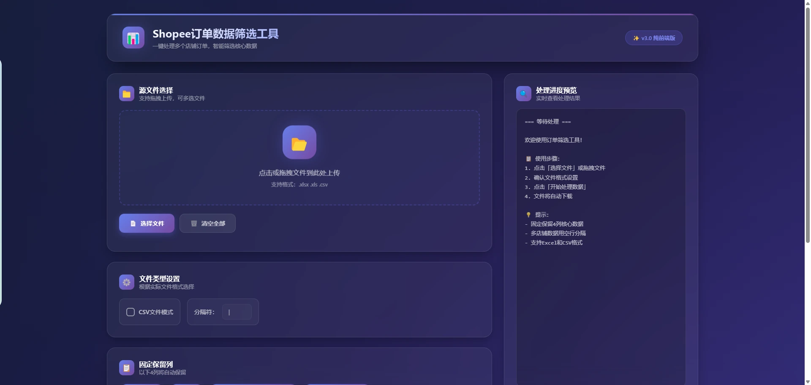
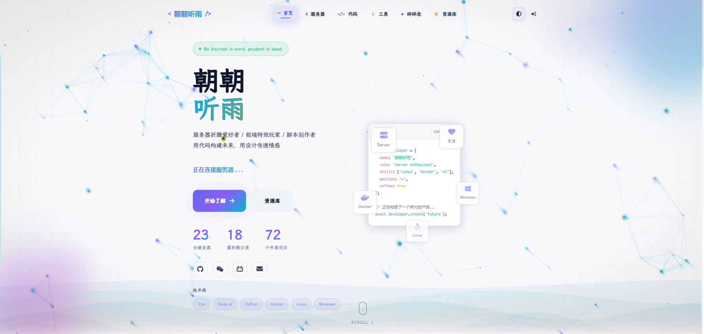

最近一段时间，电脑终于安静了一点。

不是风扇不转了，也不是消息提示彻底消失了，而是那些排着队等我处理的定制项目，大多已经交付。剩下的一些收尾、反馈和维护，也交给合作人员继续跟进。连续很久被需求、调试和交付日期推着往前走之后，日程表上总算出现了一点没有被预先占满的空白。

我没有立刻开一个新项目，而是先整理电脑。

桌面上有周报、表格转换、上架表格制作、库存清理、批量库存处理、SKU 销量汇总；往文件夹里再翻，还有订单筛选、活动 Excel 工具、图片搜索、错误 SKU 修改、自动识别、主图优化和上架状态监控。Shopee、TikTok Shop、美客多，不同平台的规则被拆进不同脚本里；同一个工具又会因为客户流程不同，留下好几个版本。

这些文件夹没有统一命名，也谈不上整齐，但它们比周报更诚实地记录了我前段时间在做什么。

[grid]

[/grid]

[grid]

[/grid]

*项目名称有的直白，有的临时，有的还带着“新”“最终版”的痕迹。它们拼在一起，就是这段时间最具体的工作记录。*

## 文件夹背后，是一个个很具体的问题

做自动化工具久了，很容易把工作概括成几个听起来很大的词：跨境电商、批量处理、流程自动化、AI 辅助。

可真正落到手上的需求，通常没有这么抽象。

它可能只是商家每天都要从平台导出一份 Excel，再按固定规则删除、筛选和拆分；可能是几千个 SKU 的库存状态对不上，需要从多个表格里重新汇总；也可能是同一批商品要适配不同平台的上架模板，字段名称、图片顺序、变体规则都不一样。还有一些工作并不难，却要不断重复：打开页面、复制内容、上传图片、检查状态、等待结果，再把异常项目重新处理一遍。

这些动作单独看都很小，连续做几个小时却足以消耗掉一个人的耐心。

我的工作，就是先把商家原本的操作完整走一遍，弄清楚哪些步骤不能变、哪些判断藏在经验里、哪些异常以前全靠人工兜底，再把它们一点点写进程序。需求沟通、流程拆解、脚本编写、界面调整、数据校验、打包交付，最后再根据真实使用反馈继续改。

有时候最费时间的并不是写代码，而是听懂一句“这里和以前一样处理就行”。所谓“以前一样”，背后可能藏着十几条没有写进文档的规则。只有把这些规则问出来、试出来，自动化才不是机械地替人点击，而是真的能接住工作。

[grid]

[/grid]

*一个项目处理订单数据，一个项目管理图像资产。界面和用途不同，出发点却一样：把反复发生的工作整理成清晰、稳定、可复用的流程。*

这也是为什么电脑里的工具越来越多。它们并不是我事先规划好的一张产品路线图，而是现实需求一点点推出来的结果。一个客户遇到库存问题，就有了库存工具；另一个客户长期受困于上架流程，就继续往表格、图片、浏览器自动化和状态监控上延伸。

回头看，这些看似零散的文件夹，其实是一张很具体的需求地图。

## 初代博客，曾经更像一间线上店铺

工具越做越多之后，我自然需要一个集中展示它们的地方。于是有了初代博客。

那时搭建网站的目标非常明确：展示能力、介绍工具、承接需求。首页要让访客尽快知道我能做什么，项目页面要说明功能、参数和使用场景，文案也要回答潜在客户最关心的问题——这个程序能解决什么、适不适合自己的业务、要怎样联系开发者。

从这个目标看，初代博客并没有做错什么。它认真完成了当时的任务，也留下了我做服务器、前端和脚本开发的一段经历。

只是现在再回头看，我发现它更像一间布置过的线上店铺，而不是我真正想长期写下去的博客。

我习惯在文章里介绍“工具具备哪些功能”，却很少写“我为什么会想到这样做”；会认真展示运行效果，却不太记录调试到深夜时到底卡在了哪里；会把项目整理成一份完整、漂亮的说明，却略过了那些绕路、误判和临时改主意的瞬间。

网站里有我完成的东西，却不一定有完整的我。

这不是初代博客的问题，而是那个阶段的我确实把大部分注意力放在了业务上。那时的网站首先要服务接单，个人表达自然排在后面。

## 第二代博客，是一次有意的减法

重新搭建 `rainzt.cn` 时，我最想做的并不是增加多少功能，而是减掉一种过强的目的性。

第二代博客仍然会写自动化工具，也不会刻意回避商业项目。跨境电商自动化依旧是我会长期深耕的方向，真实项目里积累的经验，也恰恰是最值得整理的内容。不同的是，我不再要求每篇文章都承担展示产品和转化客户的任务。

我想写下批量库存工具为什么会从一张表格变成一套流程，自动上架系统如何一点点适配 Shopee 与 TikTok Shop，主图处理为什么不能只追求“批量生成”，还要考虑平台规则、视觉一致性和异常回退。我也想记录服务器运维、前端页面打磨和 AI 辅助开发中的判断：哪些方案最后保留下来，哪些看起来聪明却不适合真实使用。

这些内容可能没有一份产品说明那么干净。它们会有失败、有犹豫，也会有“后来才发现”的补充。但对我来说，恰恰是这些不够标准的部分，才构成了真正的开发经历。

除此之外，我也想给生活留一点位置。

不一定每次都要讲一项新技术，也不一定非要总结出一条可复用的方法。有时只是项目结束后的松弛，一次重新整理桌面的感触，或者某个晚上突然想清楚的一件小事。它们不能直接换来效率，却能让我在几年之后回头时，知道自己当时如何生活、如何理解手里的工作。

## 让 AI 回到助手的位置

忙着赶项目时，我也把写文章变成过一条自动化流水线。

把 README、功能清单、代码逻辑和截图交给 AI，它很快就能整理出标题、章节和结尾。事实基本正确，结构也比我临时组织得更完整。项目刚交付、人已经很疲惫的时候，这种方式确实替我省下了许多时间。

但这种方便用久了，我也会感觉到一种落差：文章把项目说明白了，却没有把我留下来。

AI 能从资料里提炼出“系统实现了批量上架”，却不知道某个按钮为什么改过三次；它能总结订单筛选规则，却没有经历过客户一句含糊描述背后的来回确认；它可以把功能写得很专业，却很难替我判断，哪一次失败最值得记录，哪一个看似不起眼的细节真正改变了后来做项目的方法。

所以我并不打算拒绝 AI，也不会把“全部手写”当作一种必须遵守的仪式。我仍然会用它查漏、整理资料、校对表达，甚至在没有头绪时帮我搭一个起点。

我只是想慢慢把它从“替我完整交稿”的位置，放回“陪我整理和修改”的位置。重要的经历由我回忆，真正的判断由我确认，那些只属于当时心境的句子，也尽量留给自己慢慢写。

效率可以帮助我完成更多事情，但有些内容只有在放慢以后才会浮上来。

## 两种创作，可以并行

项目告一段落，不代表商业工具开发也告一段落。

以后我仍然会接触新的平台规则、新的表格格式和新的运营流程，也会继续把合适的重复劳动做成程序。商用代码解决的是客户此刻真实存在的问题，它需要稳定、准确、按时交付，也需要在变化的平台环境里不断维护。

而博客可以承担另一件事：保留那些不适合写进交付文档的东西。

这里可以有技术方案，也可以有开发感受；可以复盘一套自动上架系统，也可以只记录某次调试后的想法。商业项目追求明确结果，私人写作允许暂时没有结论。前者让我不断面对真实需求，后者让我不至于只剩下一张完成项目的清单。

它们并不冲突。

代码把复杂操作封装起来，让别人少做一些重复劳动；文字把已经过去的经历重新展开，让我看见自己是怎样走到现在。一个向外解决问题，一个向内保存思考，都是创作，只是面对的对象不同。

## 重新开始更新

整理电脑时，我没有删除那些密密麻麻的项目文件夹。

有些工具以后还会继续迭代，有些可能完成使命后就停在当前版本。再过几年，其中一部分程序也许已经不适配新的平台，甚至连当时依赖的页面都不存在了。但如果把开发过程、做过的判断和那段时间的感受写下来，它们就不会只剩下一个无法运行的旧文件。

这大概就是我重新深耕第二代博客的原因。

我并不想把它重新经营成一面更精致的商品橱窗，也不急着证明自己能保持多高的更新频率。我只想在忙碌告一段落之后，重新留出一块可以慢慢写字的地方。

往后，工具还会继续做，需求还会继续变化，电脑里的文件夹大概也不会真正变少。

但这一次，我希望它们增长的同时，博客里也能留下另一条时间线：不只记录我完成了什么，也记录我为什么开始、如何走过，以及一路上究竟想过些什么。
