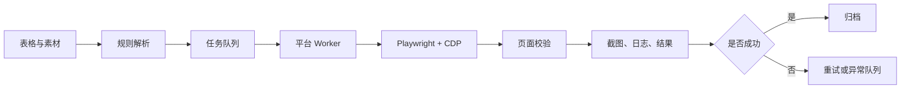
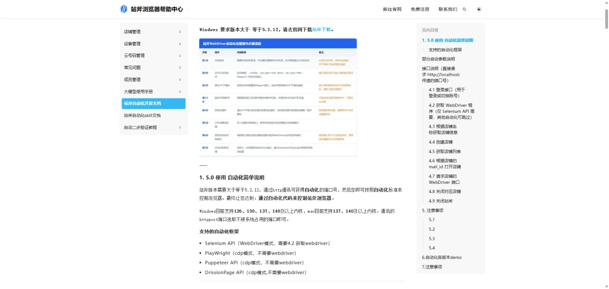
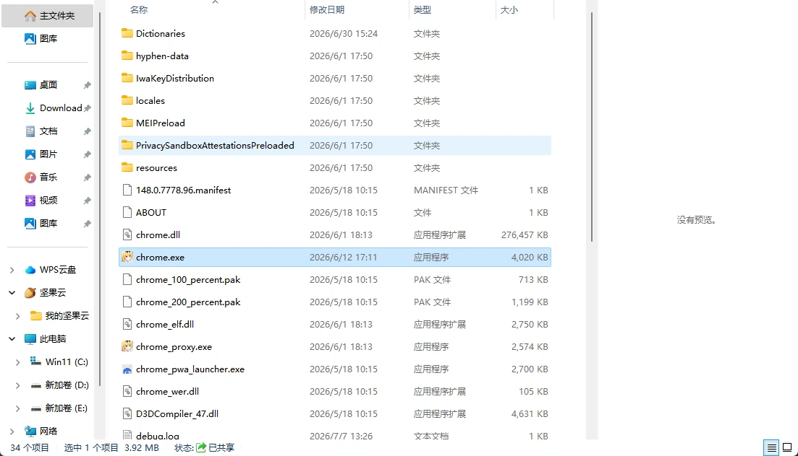
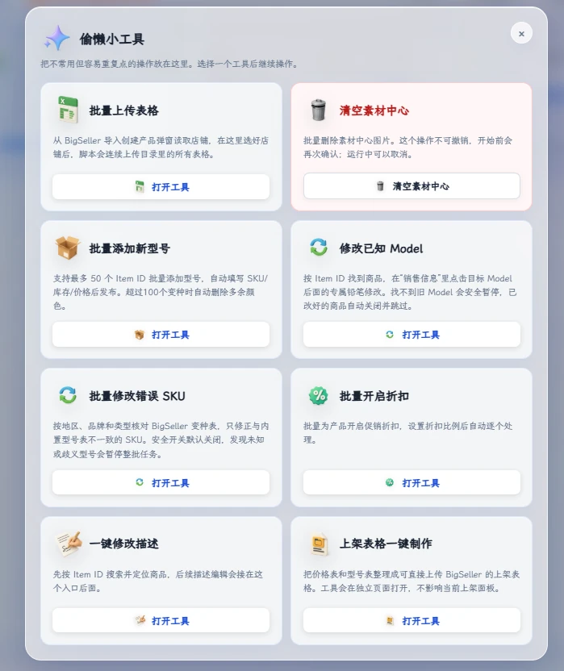
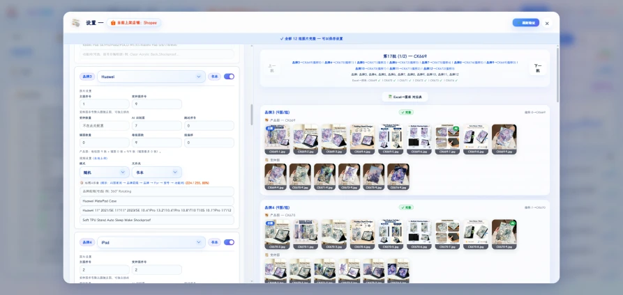
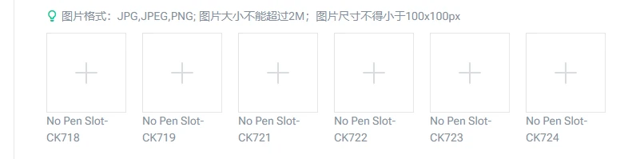
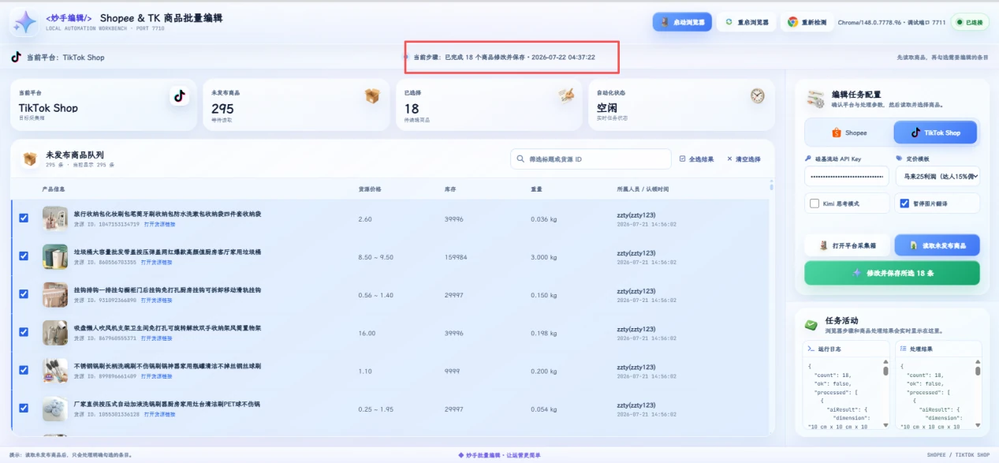
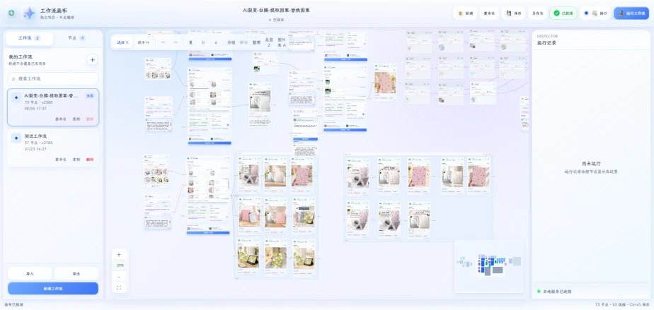

2026 年 5 月底，我第一次把 AI 真正放进跨境电商的日常工作里。不是让它帮我写一段宣传文案，也不是问它一个 API 怎么调用，而是让它参与搭建一套全自动上架系统。

这件事最初的动机很朴素：每天重复打开页面、整理表格、上传图片、匹配规格、修改标题，再盯着页面确认有没有保存成功。单次操作并不难，难的是每天重复几十次以后，人的注意力会先于代码耗尽。

后来我发现，电商自动化真正难的部分从来不是“让浏览器点一下按钮”，而是把业务规则讲清楚，再把每个容易出错的环节做成可以观察、可以重试、可以追责的流程。下面就记录这套思路，也把我在实践中踩过的坑一起写下来。

## 先说结论：自动化的核心不是点击，而是规则

很多人第一次做浏览器自动化，会从录制操作开始：打开页面、点击按钮、填入文本、上传文件，然后把录制结果保存成脚本。这种方式在演示阶段很直观，但一旦页面结构、商品规格或图片顺序发生变化，脚本就会变得非常脆弱。

我现在更愿意把一次上架拆成四层：

1. **数据层**：表格、图片、视频、规格和标题素材分别是什么。
2. **规则层**：什么图片属于哪个 SKU，什么规格允许发布，标题如何拼接。
3. **执行层**：由 Playwright、CDP 和平台适配器完成页面操作。
4. **观察层**：任务做到哪一步、为什么失败、是否进入异常队列，都要有记录。

可以把它理解成下面这条链路：



我希望它是全自动执行，但不是无法解释的黑盒。自动化可以替我完成机械动作，每一步也必须留下可以追溯的痕迹。

## 为什么我更推荐从 ERP 开始

理论上，直接操控店铺后台当然也能实现自动上架。但在实践中，我更推荐先围绕 ERP 做自动化，原因主要有三个。

### 1. ERP 的数据更结构化

商品名称、规格、库存、价格、图片和视频通常都已经被整理成字段。自动化系统不必从一个复杂页面里猜测“这段文字到底是什么”，而是可以先读取结构化数据，再按照模板生成任务。

### 2. 风险边界更清楚

如果所有平台都直接接入，某个平台的小改版就可能影响整条流程。ERP 作为中间层，可以把共用的数据准备、素材管理和任务记录放在一起，再把 Shopee、TikTok Shop 等平台的差异放进各自的 Worker 里。

### 3. 多平台差异可以被隔离

Shopee 和 TikTok Shop 的页面入口、编辑按钮、保存逻辑和成功提示并不一样。如果强行写成一套流程，后期会出现大量条件分支。更稳定的方式是共用底座，平台只负责自己的适配。

指纹浏览器同样可以做自动化，而且对某些场景很方便。但账号风险、登录状态和长期大规模运行是否稳定，不能只凭一次成功运行就下结论。使用这类方案时，需要自行评估平台规则、账号权限和风控边界，不要把“能跑通”误认为“可以无限放大”。



## 技术底座：Playwright、CDP 与固定 Chromium

我的技术组合是 Playwright + CDP + 固定版本 Chromium。

Playwright 负责定位元素、填写表单、上传素材、等待页面状态和截取结果；CDP 负责连接已经打开的浏览器；固定版本 Chromium 则尽量减少不同浏览器版本带来的接口差异。

连接浏览器的大致代码如下：

```ts
import { chromium, type Browser } from "playwright";

export async function connectBrowser(cdpUrl: string): Promise<Browser> {
	return chromium.connectOverCDP(cdpUrl);
}

const browser = await connectBrowser("http://127.0.0.1:9222");
const context = browser.contexts()[0] ?? (await browser.newContext());
const page = context.pages()[0] ?? (await context.newPage());

await page.goto("https://example.com/products", {
	waitUntil: "domcontentloaded",
});
```

固定 Chromium 的代价是项目体积会大一些，但它解决了两个实际问题：一是不同浏览器版本的接口行为不完全一致，二是图片上传顺序、文件选择器和页面等待时机更容易出现细微差异。对于需要重复运行的任务，我更愿意牺牲一些体积，换取结果的一致性。



需要注意的是，CDP 不是“绕过平台规则”的通行证。它只是让自动化程序连接到浏览器调试端口，实际仍然是在页面上进行正常的用户操作。登录状态、权限和平台规则都应该由运营者自己负责。

## AI Agent 到底帮了什么忙

我并没有让 AI 直接生成一个“万能上架机器人”，而是把它当成一个会观察、会提问、会整理的开发搭档。

它最有价值的地方，通常在下面几个环节：

- **观察页面**：读取当前页面的按钮、表格、规格和错误提示。
- **拆解流程**：把“上架一个商品”拆成可验证的步骤。
- **定位问题**：当选择器失效时，根据截图和日志判断是页面未加载、入口变化还是权限问题。
- **整理规则**：把散落在聊天记录和经验里的判断，整理成配置文件和校验函数。
- **生成样板代码**：先快速搭出 Worker、日志、重试和页面对象，再由我检查细节。

最重要的一点是：AI 可以帮我更快地把想法变成可运行的东西，但它不知道我的业务边界。比如“这个 SKU 的第 3 张图不能上传”可能是一个临时异常，也可能是这个产品本来就没有第 3 张图。最终决定规则的人，仍然是我。

## 两种业务场景，不能用同一套规则

### POD 产品：规则稳定，适合批量化

POD 产品通常有比较规整的数据和素材：款式、颜色、尺寸、主图、详情图和变体之间有明确关系。只要把模板定义清楚，就可以批量处理很多商品。

### 搬运或铺货：差异更大，但同样可以全自动

搬运和铺货同样可以全自动。它们通常需要翻译、清理厂家信息、生成场景图、判断平台类目、重新组织规格，规则确实比 POD 更复杂，但复杂不等于必须人工逐条确认。只要把这些判断拆成可配置的规则和可调用的 AI 步骤，就可以让采集、清洗、翻译、配图、SKU 生成、上架和发布全部自动跑完。

真正需要保留的是异常队列，而不是人工审批链：缺少必填字段、图片不符合尺寸、类目无法判断或平台返回风险提示时，任务暂停在可定位的节点，修正规则或补齐数据后再自动继续。我的做法是共享任务队列、日志和素材中心，但为不同产品线保留独立模板和校验策略。



## 图片与 SKU 的匹配：最容易被低估的难题

图片文件名看起来很简单，真正处理起来却非常容易错位。

例如下面是一组商品素材：

```text
AB001-1.jpg  # AB001 主图
AB001-2.jpg  # AB001 详情图
AB001-3.jpg
AB001-4.jpg
AB001-5.jpg

AB002-1.jpg  # AB002 另一种颜色或规格的主图
AB002-2.jpg
```

最基础的规则是：同一个前缀属于同一个图片组，`-1` 作为主图，其余作为详情图。但仅靠字符串切分还不够，至少要同时做三层校验：

```ts
type AssetGroup = {
	key: string;
	cover: string;
	detail: string[];
};

function groupAssets(files: string[]): AssetGroup[] {
	const groups = new Map<string, string[]>();

	for (const file of files) {
		const match = file.match(/^(.+)-(\d+)\.(png|jpe?g|webp)$/i);
		if (!match) continue;

		const [, key] = match;
		const list = groups.get(key) ?? [];
		list.push(file);
		groups.set(key, list);
	}

	return [...groups.entries()].map(([key, list]) => {
		const ordered = [...list].sort((a, b) => {
			const aNo = Number(a.match(/-(\d+)\./)?.[1] ?? 999);
			const bNo = Number(b.match(/-(\d+)\./)?.[1] ?? 999);
			return aNo - bNo;
		});

		return {
			key,
			cover: ordered[0],
			detail: ordered.slice(1),
		};
	});
}
```

代码只能完成“文件名分组”，不能代替业务校验。真正执行上传前，还要检查：

1. 当前 ERP 页面显示的 SKU 是否等于图片组的 `key`。
2. 主图是否确实是 `-1`，有没有缺号或重复编号。
3. 当前变体的颜色、尺寸与表格字段是否一致。
4. 当前任务有没有读到下一组产品的图片。

第三点和第四点很关键。曾经遇到过流程全部显示成功，但图片被挂到了错误 SKU 上。因为系统只看到了“上传成功”，却没有验证“上传到了正确的位置”。自动化要判断的是业务结果，而不是浏览器动作有没有报错。





## 把平台操作写成 Worker，而不是一条超长脚本

一个平台 Worker 可以只负责一件事：接收标准化任务，完成这个平台的页面操作，并返回结构化结果。

```ts
type ListingTask = {
	productId: string;
	title: string;
	variants: Array<{ sku: string; images: string[] }>;
};

type ListingResult = {
	ok: boolean;
	productId: string;
	step: string;
	error?: string;
};

export async function publishToShopee(
	page: import("playwright").Page,
	task: ListingTask,
): Promise<ListingResult> {
	try {
		await page.getByPlaceholder("搜索商品").fill(task.productId);
		await page.getByRole("button", { name: "编辑" }).click();

		await page.getByLabel("商品标题").fill(task.title);
		await uploadImages(page, task.variants);
		await verifyVariants(page, task.variants);

		await page.getByRole("button", { name: "保存并发布" }).click();
		await page.getByText("发布成功").waitFor({ state: "visible" });

		return { ok: true, productId: task.productId, step: "published" };
	} catch (error) {
		return {
			ok: false,
			productId: task.productId,
			step: "publish",
			error: error instanceof Error ? error.message : String(error),
		};
	}
}
```



这里有两个值得保留的习惯：

- 每完成一个高风险步骤，就记录一个明确的 `step`。
- 返回结构化结果，而不是只在控制台打印一句“失败了”。

这样做的好处是，后续可以把 Shopee、TikTok Shop 或其他平台的结果统一放进任务历史里，界面不需要知道每个平台内部的细节。

## 失败重试，但不要无脑重试

网络波动、页面响应慢和临时弹窗都可能造成偶发失败，所以任务需要重试机制。但“失败就再点一次”也很危险，尤其是发布、扣库存或创建优惠券这类不可逆动作。

我会把步骤分成三类：

- **可安全重试**：打开页面、读取列表、等待元素、获取截图。
- **需要幂等判断后重试**：上传图片、保存草稿、更新标题。
- **不做盲目重试**：最终发布、扣库存、创建订单等有副作用的操作，先做幂等校验，再由任务状态机自动决定是否继续。

一个简单的重试包装器可以这样写：

```ts
async function retry<T>(
	action: () => Promise<T>,
	options: { attempts?: number; delayMs?: number } = {},
): Promise<T> {
	const attempts = options.attempts ?? 3;
	const delayMs = options.delayMs ?? 800;
	let lastError: unknown;

	for (let i = 0; i < attempts; i += 1) {
		try {
			return await action();
		} catch (error) {
			lastError = error;
			if (i < attempts - 1) {
				await new Promise((resolve) => setTimeout(resolve, delayMs));
			}
		}
	}

	throw lastError;
}
```

真正接入系统时，还要给重试加上截图、当前 URL、任务 ID 和步骤名。否则过几天回头看日志，只知道某个任务失败过，却不知道当时页面到底是什么状态。

## 为什么一定要做可视化界面

自动化不是越黑盒越高级。对于电商任务，我希望界面至少能回答下面这些问题：

- 当前正在处理哪一个商品、哪一个 SKU？
- 已经完成了多少步，卡在哪一步？
- 失败是网络问题、页面变化，还是业务规则不匹配？
- 图片和规格有没有完成对应校验？
- 是否保存了关键截图和日志？
- 这个任务可以安全重试，还是应该进入异常队列？

所以我会把运行面板当成产品的一部分，而不是开发阶段的调试工具。实时日志、成功/失败统计、暂停/恢复、截图留档和历史记录，都会直接影响运营人员是否敢于使用这套系统。

最理想的状态不是“所有任务都永远成功”，而是任务失败时，系统能在几十秒内定位原因，把任务放回重试队列或异常队列，而不是让人重新从头操作。

## 从自动上架继续往外扩展

自动上架只是一个入口。围绕同一套数据、素材和任务系统，后续可以继续扩展：

- AI 生成商品主图、换背景和场景图；
- 根据平台规则自动生成多语言标题和描述；
- 采集供应商商品并清理厂家信息；
- 跑图、算价、整理利润和库存；
- 批量设置折扣、优惠券和活动价格；
- 在发布前做违禁词、图片尺寸和品牌信息检查；
- 用队列调度不同店铺，并保留团队操作审计。

这些功能看起来分散，其实共享的是同一条底座：结构化数据、可追踪的任务、明确的规则和可靠的执行器。底座稳定以后，新增一个工具不再是复制一份脚本，而是接入同一套任务系统。



## 最后：Agent 替我完成动作，但不会替我承担判断

这次实践让我最明显的感受是，AI 把“想法到原型”的距离压缩得非常短。以前可能要先查文档、搭环境、写一堆样板代码，才能看到第一个页面；现在可以先把业务目标、页面截图和现有规则交给 AI，让它帮助我拆分模块、定位元素、补齐日志，再由我持续校正。

但效率提高以后，真正重要的判断反而更贵了：为什么要做这个工具？哪些规则必须固定？哪些异常不能自动处理？出了问题由谁确认和负责？

Agent 可以观察页面、整理数据、调用工具，也可以陪我把一个流程逐步变成代码。它能替我完成大量机械执行，却不能替我决定什么结果才算正确。

所以我对“AI 赋予电商自动化”的理解，不是让人从系统里消失，而是让人从重复点击和逐条审批里出来，把时间留给规则设计、体验和异常处理。全自动铺货并不意味着盲目放行，而是让每个判断都有规则、有校验、有记录，只有真正无法判断的异常才会被单独拎出来。
