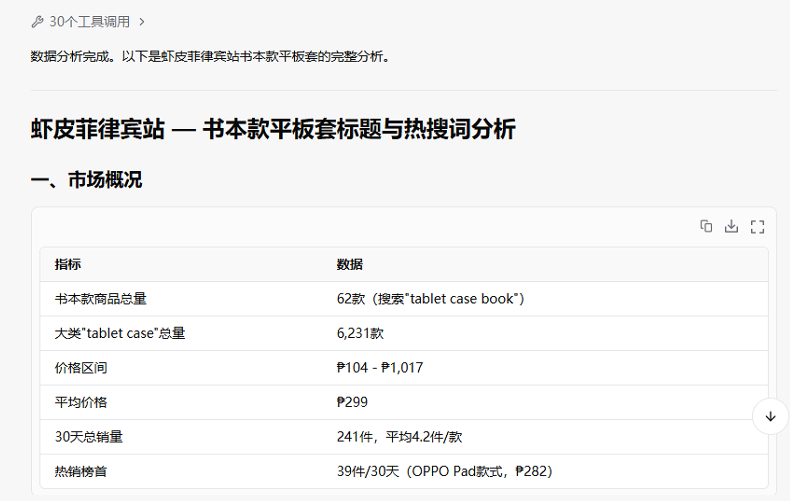
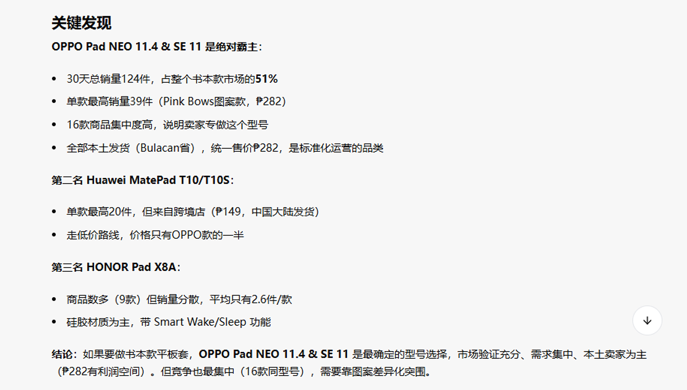

最近出来了一个新的模型决策 AI——Ai-Jev。它有意思的地方，不只是“能不能把问题回答得更好”，而是它开始让我重新思考：如果让 AI 长期观察数据、判断下一步该做什么，再调用不同的工具和 Agents 去执行，跨境电商是不是可以从一堆零散的自动化脚本，变成一套真正会自己运转的系统？

我想到的不是再做一个“自动上架工具”，而是搭建一套跨境电商 Agents：选品、采集、竞品研究、标题和详情页、本地化运营、生图、质检、上架、广告投放、客服和数据复盘，尽可能都接入同一个任务系统。

目前这还只是一个进行中的实践，完成度大概在 50% 左右。但已经足够让我看到一个方向：未来的跨境电商，可能不是一个人管理一家店，而是一个人设定目标和边界，再让一组 Agents 持续做研究、执行和试错。

## 1. 为什么我会想到 OPC + AIGC + Agents

传统 OPC，也就是一个人或一个很小的团队运营一家跨境店铺，最大的限制并不是不会做，而是精力很难同时覆盖所有环节。

一个人要找产品、看竞品、算利润、联系供应链、做图片、写标题、上架、投广告、看数据、处理客服和售后。每件事单独看都不复杂，但它们会在一天里不断切换。广告需要盯，商品需要更新，平台规则也可能随时变化，最后往往是最重要的判断没有时间做，时间都消耗在重复操作上。

传统自动化可以解决一部分重复点击，却很难处理开放环境里的变化：页面改版了怎么办？竞品标题变了怎么办？一张图虽然生成成功，但主产品被遮挡了怎么办？广告数据不够好，到底应该改素材、改价格，还是直接停止测试？

单独使用大模型也有另一个问题：它可以帮我分析一次、生成一张图、写一段文案，但不会天然地记住整个店铺的状态，更不会自动完成后续执行和验证。

所以我更想做的是三层组合：

| 层级 | 作用 |
| --- | --- |
| 数据和工具 | 采集平台前台数据、商品素材、店铺指标、广告数据和供应链信息 |
| Agents | 分别执行选品、文案、生图、上架、投放、客服等具体任务 |
| Ai-Jev 决策层 | 判断现在要不要调用 Agent、调用哪个 Agent、是否继续、是否重试或停止 |

简单说，Agent 负责做事，Ai-Jev 负责决定下一步做什么，数据再把结果反馈回来。

> 数据与信号 → Ai-Jev 判断 → 调用 Agent 执行 → 质量检查 → 结果回流 → 下一轮决策

这比“让一个模型包办所有事情”更接近真实业务，也更容易逐步替换和扩展。

## 2. AI 上架与本地化运营：不只是把商品翻译过去

自动上架只是最容易被看见的一层。真正有价值的是，Agent 可以把一个商品从“原始素材”转换成“适合某个市场、某个平台、某家店铺的商品页面”。

一条比较完整的链路可以是：

1. 从供应商、平台前台或已有商品库采集商品信息；
2. 清理厂家信息、重复描述和不适合目标市场的表达；
3. 判断目标平台类目、属性、规格和变体结构；
4. 参考当地竞品标题、卖点、价格区间和图片结构；
5. 生成目标语言的标题、五点描述、详情文案和搜索词；
6. 根据利润、运费、平台佣金和活动规则计算价格；
7. 生成或整理图片，再做尺寸、主体、文字和合规检查；
8. 最后才调用平台或 ERP 的上架 Agent 执行发布。

本地化也不应该只是逐句翻译。不同市场对卖点的关注点、表达习惯、尺寸单位、场景和审美都不一样。一个在中国电商页面里成立的标题，直接翻译之后可能既不自然，也没有覆盖当地用户真正搜索的词。

我希望 Agent 在上架前先去目标地区的平台前台看一遍：这个类目现在的主流标题怎么写，竞品图片怎么排，消费者评论里反复抱怨什么，再结合自己的产品条件生成更适合的版本。

*这类分析可以作为本地化上架前的输入，让标题、卖点、图片和价格不再完全凭经验决定。*

真正执行上架时，系统仍然需要任务队列、状态记录和异常队列。商品缺少必填属性、图片尺寸不对、类目无法判断、品牌信息存在风险时，不能为了追求“全自动”而强行发布，而应该停在具体步骤，让人补充信息或让另一个 Agent 重新处理。

## 3. AI 选品：从“我觉得会卖”变成可验证的假设

我理解的 AI 选品，不是让模型直接给我一个“爆款名单”，而是让它持续收集信号，帮我把一个模糊的想法拆成可以验证的假设。

它可以观察：

- 搜索词和类目的增长趋势；
- 商品数量、价格区间和近 30 天销量；
- 头部商品的销售集中度；
- 竞品的标题、主图、详情结构和评论痛点；
- 本地卖家和跨境卖家的比例；
- 物流体积、退货风险、供应稳定性和毛利空间；
- 是否存在专利、商标、外观或平台合规风险。

例如下面这次平板保护套的分析，Agent 不是只说“这个品类不错”，而是先整理样本数量、价格、销量和热销商品，再给出具体的型号集中度和竞争判断。这样得到的结论，才有机会转成后续的上架和广告测试计划。

选品 Agent 的输出也不应该只有一个分数，更应该包含：为什么值得测试、最大的风险是什么、需要准备哪些素材、第一批要测几个价格、预算上限是多少、什么数据出现后应该停止。

最终的选品逻辑可以变成一个小实验：先选出若干候选产品，生成最低成本的商品页和素材，给它们一个可控预算，观察点击率、加购率、转化率、退款和利润，再决定要不要扩大。AI 可能会误判，但只要每一次判断都有记录、每一次尝试都有结果，系统就会慢慢积累出属于自己的经验。

## 4. AI 生图：从一次生成，变成生成—识别—淘汰—重生成

传统生图流程通常是：写提示词、生成一张图、觉得差不多就用了。问题在于，“生成成功”不等于“适合卖货”。主产品可能被杯子、花瓶或手部遮住，产品结构可能变形，颜色可能和实物不一致，画面里还可能出现不应该存在的配件。

我现在更关注的是让 Agent 参与图片质量闭环：

1. 根据商品本身和目标市场竞品，制定这组图的用途；
2. 调用生图工具生成主图、场景图、细节图和使用图；
3. 让视觉检查 Agent 判断主体是否完整、产品是否被遮挡、数量和颜色是否正确；
4. 不合格的图片进入淘汰队列，记录具体问题；
5. 只针对问题重新生成，而不是每次从头碰运气；
6. 通过后再按平台尺寸和详情页顺序整理上传。

下面是一次实际遇到的问题。第一版详情图的场景氛围不错，但主产品被画面元素遮挡，作为商品展示图并不合格。Agent 识别到这个问题后，没有把它直接放进商品页，而是重新调整主体位置和展示方式，生成了可以继续进入候选池的版本。

*问题版本：画面有氛围，但没有优先保证商品主体清晰可见。*

*调整后：保留场景感，同时补充更清晰的产品展示和使用场景。*

这也是我觉得 Agents 比单次调用生图 API 更有价值的地方。它不只是“会生成”，而是可以判断结果是否值得留下。未来还可以加入品牌色、产品结构比对、文字区域检测、平台图片规范检查，甚至让它根据广告数据判断哪一种视觉方向更值得继续测试。

## 5. AI Agent 可以覆盖跨境电商的哪些环节

如果把自动上架当成入口，后面可以继续扩展成一条完整的经营链路。

### AI 竞品研究与市场监控

Agent 可以定期访问目标平台的前台，记录竞品的标题、价格、销量、促销、评论和图片变化。当某个竞品突然降价、某个关键词开始出现大量新商品，或者某种素材结构明显变多时，系统可以把变化整理成提醒，而不是等人偶尔打开页面才发现。

### AI 标题、详情和本地化内容

同一个产品可以根据国家、平台、流量入口生成不同版本。Agent 负责从竞品中提取表达方式，再结合自己的真实参数生成标题和详情，避免夸大功能、遗漏关键属性或直接复制竞品内容。

### AI 广告投放与素材实验

它可以结合曝光、点击、点击成本、加购、转化、利润和库存判断下一步动作：保留哪张图、暂停哪个广告组、调整哪个关键词、是否扩大预算、是否需要重新生成素材。

这里最重要的不是让 AI 每分钟都改一次广告，而是让它提出可解释的实验假设。例如“点击率不错但转化低，可能是主图承诺与详情页不一致”，然后只调整一个变量，用数据验证，而不是同时改价格、标题、图片和预算，最后什么也分析不出来。

### AI 客服、评论与售后

Agent 可以把评论和客服对话按问题分类，提炼出高频疑问，再反过来优化详情页和 FAQ。常见问题可以自动回复，涉及退款、纠纷、敏感承诺或高风险客户时再交给人工处理。

### AI 定价、库存与供应链

结合采购价、物流费、平台佣金、广告成本和退货率，系统可以持续计算真实利润，而不是只看销售额。库存不足时暂停投放，库存积压时设计折扣测试，供应商涨价时重新评估售价和广告上限。

### AI 合规与风险检查

发布前检查违禁词、品牌词、图片中的商标、虚假承诺、类目属性和当地法规要求。它不能替代专业法律意见，但可以把大量低级错误挡在发布前，减少因为疏忽造成的风险。

## 6. 我设想的运行方式：固定脚本负责日常，Ai-Jev 负责决定何时调用 Agents

我并不想把所有事情都交给一个模型实时处理。很多重复、稳定、规则清晰的工作，用固定脚本跑更可靠；只有遇到需要理解、比较和判断的场景，才让 Ai-Jev 调用对应的 Agent。

例如：

- 日常同步库存、整理文件、检查任务状态，用固定脚本运行；
- 发现某个市场的销量、价格或竞品结构出现变化，交给 Ai-Jev 判断是否启动选品 Agent；
- 发现图片质量检测失败，调用生图和视觉审核 Agent；
- 发现平台页面改版或任务异常，把截图、日志和当前步骤交给 GPT Luna 处理；
- 广告数据达到预设条件后，生成一个新的素材或预算实验，而不是无条件改动账户。

这样做的好处是成本、速度和稳定性更可控。AI 不需要在每一个普通动作里重复思考，而是在出现变化或需要决策时介入。

## 7. 从一家店开始，把成功逻辑复制到更多店铺

传统 OPC 的问题之一，是一个人很难长期盯住很多店铺。但如果第一家店铺的流程被整理成数据、规则、素材模板、任务状态和复盘结果，后续就不必每次重新从零开始。

可以复制的不是某个店铺的具体商品，而是一套经过实践验证的逻辑：

- 什么样的产品值得进入测试池；
- 什么样的图片结构更适合这个市场；
- 标题和详情页如何本地化；
- 什么指标出现后开始加预算；
- 什么异常必须人工确认；
- 什么情况下应该停止一个产品。

复制到新店铺或新市场时，Agents 可以重新读取当地数据，调整语言、价格、素材和投放策略。这样是“复制方法”，不是把同一份内容机械铺到所有店铺。

更进一步，系统还可以自己提出新的尝试：新的标题结构、不同的主图风格、不同的价格区间、不同的广告受众。人负责设定边界和预算，AI 负责提出更多低成本实验。

## 8. 这件事真正难的地方，不是调用模型

现在回头看，接入一个模型、调用一个生图工具、写一个浏览器 Worker，都不是最难的部分。真正困难的是把业务目标变成可判断的规则。

比如：什么叫“图片合格”？什么叫“产品值得继续投”？什么情况下可以自动发布？什么情况下必须停下来问人？如果这些问题没有定义清楚，Agents 只会更快地制造更多不确定结果。

所以我会把下面几件事放在系统底座里：

- 每个任务都有唯一 ID、当前步骤和可追溯日志；
- 发布、扣库存、改预算等有副作用的动作必须做幂等检查；
- 不确定的结果进入异常队列，不允许无限重试；
- 重要操作保留截图、输入、输出和决策原因；
- 不同店铺、国家和平台使用独立的权限、规则和素材；
- AI 的结论必须能回到数据，而不是只给一个看起来很确定的答案。

AI 也可能误判，广告数据也可能因为样本太少而产生错觉，竞品的动作更不代表自己的产品一定适合照搬。我的目标不是让系统永远正确，而是让它可以低成本地尝试、及时发现错误、快速停止，并且从结果里积累经验。

## 9. 现在做到哪一步了

目前这套跨境电商 Agents 还没有完全成型，大概完成了 50%。已经能够看到的部分包括：采集和分析数据、根据竞品辅助选品、生成本地化内容、调用生图、对生成结果做检查，以及把任务继续交给上架流程。

接下来还需要继续解决：多店铺状态管理、广告数据的长期记忆、不同平台的权限和风控、素材与真实商品的一致性、实验结果归因，以及在自动化失败时如何更准确地把问题交给合适的人或 Agent。

但我觉得它不需要等到 100% 完美才有价值。只要它能把一次选品、一次上架、一次生图或一次广告实验闭环跑通，就可以从一个真实店铺开始积累数据。跑得越多，规则越清楚，后面的店铺就越容易复用。

## 最后：让人从重复操作里出来，把时间留给判断

我并不认为未来的跨境电商会变成“完全不需要人”。相反，人的工作会从每天盯着页面、搬运数据、修改几十个标题，转向设定目标、约束预算、判断方向和处理真正复杂的异常。

Ai-Jev 负责做更长周期的判断，Agents 负责调用工具和完成任务，固定脚本负责稳定的日常流程，数据负责告诉我们结果到底有没有变好。这个组合也许还不成熟，甚至会误判，但它至少提供了一种新的工作方式：一次只经营一家店铺的人，可以开始尝试管理一套能够持续学习和复制的经营系统。

这就是我现在想做的跨境电商 Agents。它不是一个“自动上架按钮”，而是一套从 AI 选品开始，经过本地化内容、生图质检、自动执行、广告实验和数据复盘，逐步走向自动经营的系统。
