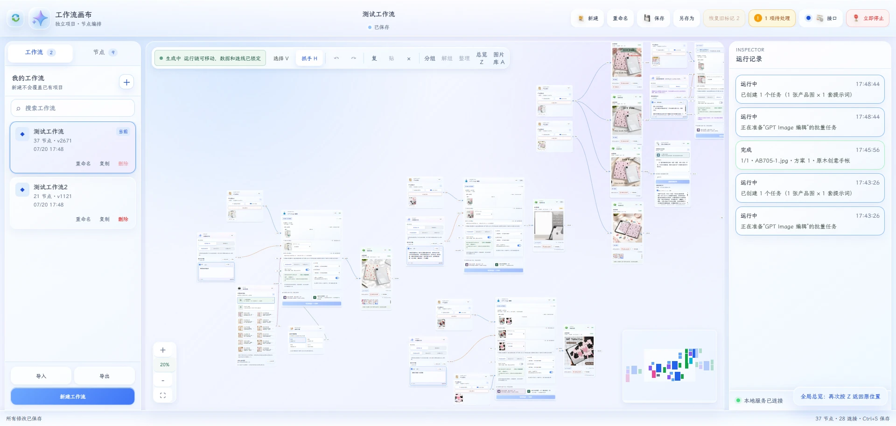
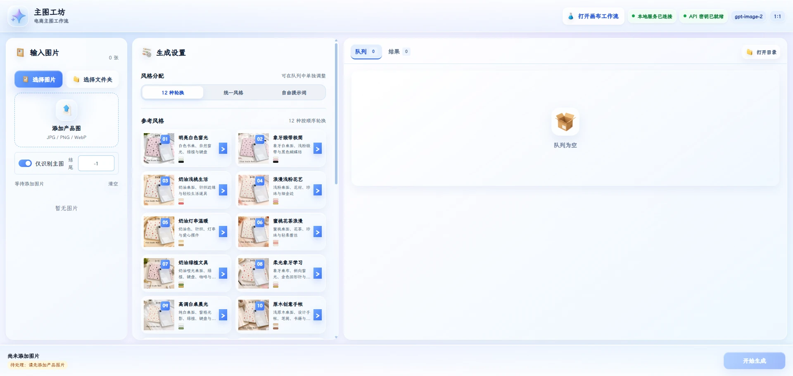
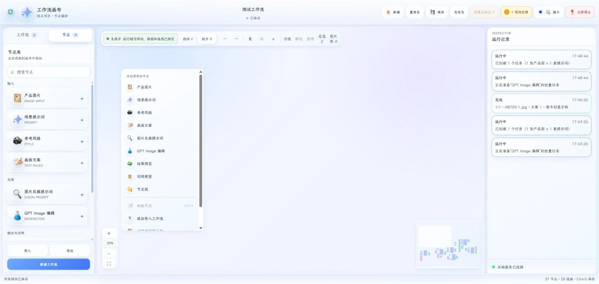

电商主图的生产，往往卡在一种看似琐碎、实际高频的往返里：找产品图、写场景描述、补品牌规则、调整视觉风格、反复生成，再把满意的结果归档。单次操作并不复杂，但一旦要做批量素材、多人协作或持续迭代，素材、提示词和结果就很容易散落在不同工具与文件夹里。

这套 AI 无限画布工作流，想解决的正是这件事。它是一套面向电商主图批量生成的本地可视化工作台，把创作过程从一串零散操作，变成一张可以看见、编辑、复用和追溯的生产地图。

## 为什么要做这套画布

传统图片生成通常以对话或单个表单为入口，适合快速尝试，却不擅长表达完整的创作关系。产品图从哪里来，使用了哪版场景提示词，参考了哪张风格图，哪次生成最适合上架，往往需要靠人工记忆和文件命名维持。

无限画布提供了另一种组织方式：每一个输入、规则、模型调用和结果都是一个节点；节点之间的连线，就是素材流动和决策发生的路径。画布不是装饰，它让工作流本身成为可阅读、可讨论的内容。

## 现在先把图片主图跑稳

当前版本聚焦图片，目标不是做一个只会出图的入口，而是把电商主图生产中真正需要反复使用的部分固定下来。

从产品图开始，可以连接场景描述、参考风格、品牌文案与商品卖点，再把这些信息汇入视觉提示词节点和 GPT Image 生成节点。生成完成后，结果图会直接回到画布中，成为下一轮调整、对比或复用的输入。

这种结构很适合电商素材：同一件商品可以快速尝试不同场景和构图；同一套品牌规则也可以被多个商品项目复用。创作不再从空白提示词开始，而是从已经沉淀下来的工作流继续。

## 节点化，让规则可以复用

画布中的节点不是单一的“输入框”。它们承载的是不同类型的生产信息：

- 产品图片和商品信息，定义画面的主体。
- 场景、风格和参考图，控制画面的氛围与视觉方向。
- 文案规则和品牌约束，保证素材能够被实际使用。
- 视觉提示词和图片生成节点，把前面的信息汇总为可执行的生成任务。
- 预览、结果和执行状态节点，帮助快速判断一次任务是否值得保留。

节点库把这些能力按用途整理，画布则允许它们按实际需求自由组合。对于一个成熟的主图方案，可以保存为模板；对于一次试验，也可以局部替换一个节点，而不影响整张画布的其他部分。

## 运行前校验，运行后复盘

一套可以进入日常生产的工作流，不能只在“生成”时出现。画布会在执行前检查必要输入与节点连接，让缺少产品图、提示词或生成配置的问题尽量提前暴露。

执行过程中的状态、日志和结果也会留在项目内。这样一来，某张主图为什么有效、使用了什么组合、下一次该从哪里继续优化，都不需要重新猜测。项目切换、工作流保存和结果归档，最终服务的是一种更稳定的创作节奏。

## 从图片走向视频

图片是这套系统的第一站，也是最需要先跑稳的一站。主图生成已经具备了清晰的输入、规则、模型执行和结果回收链路，而这套链路天然可以继续向视频扩展。

未来的视频画布会继续沿用同一套可编排思路：把商品资产、脚本、分镜、镜头参考、关键帧、配音与视频提示词放到同一张工作流中；生成后的片段再进入预览、筛选、拼接与复盘。最终输出不只是单张电商主图，而是一条能够适配不同平台节奏的商品短视频。

## 愿景：把素材生产变成可编排的系统

AI 的价值不应该只停留在“更快生成一张图”。更值得建设的是一套能持续积累的生产系统：每次尝试都会留下可复用的节点、规则和路径；每个成功案例都能变成下一次创作的起点。

这张无限画布会先帮助图片主图生产变得更清晰、更可控，随后逐步连接到视频内容。让产品素材从静态图片到动态短片，都能在同一个工作流里被组织、生成、评估和持续优化。
