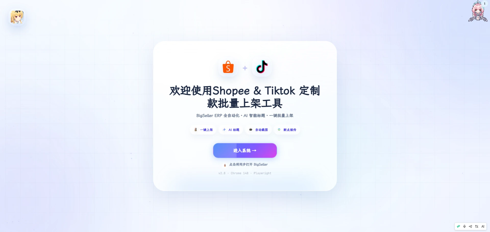
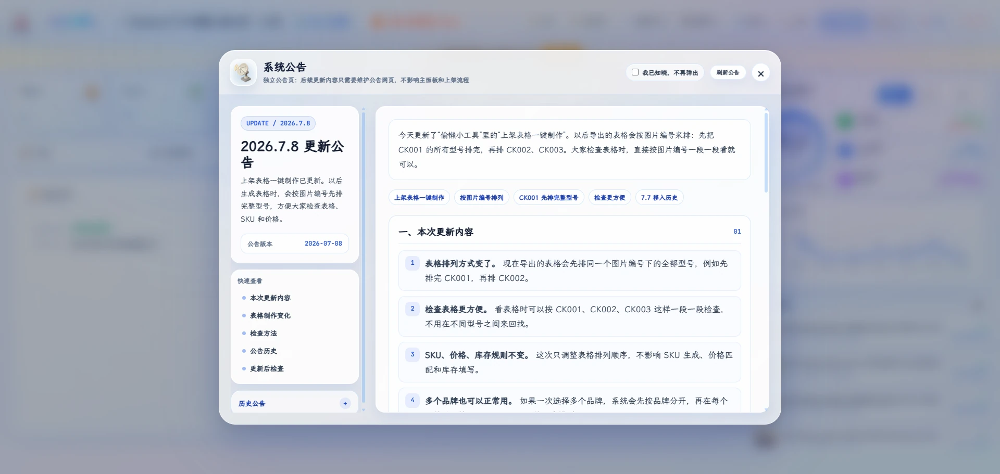
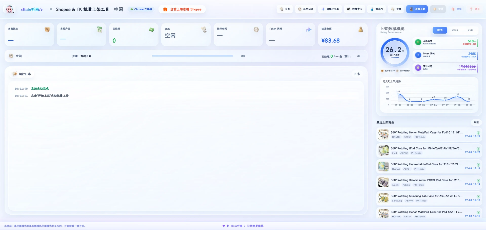
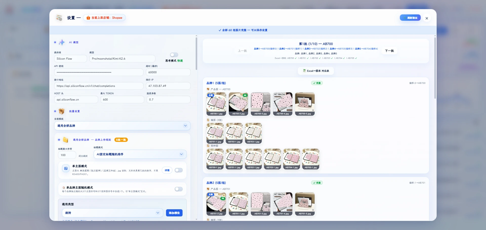
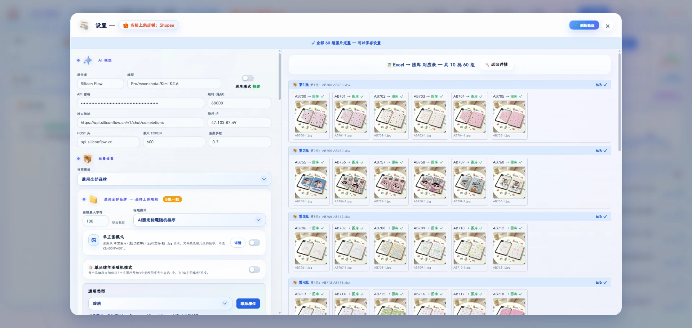
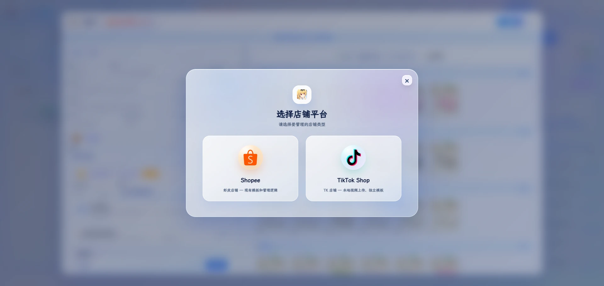
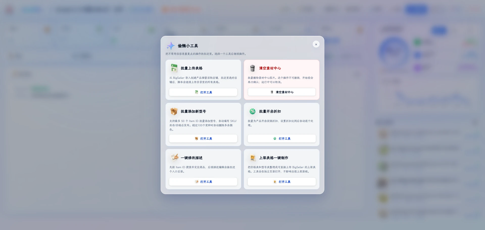
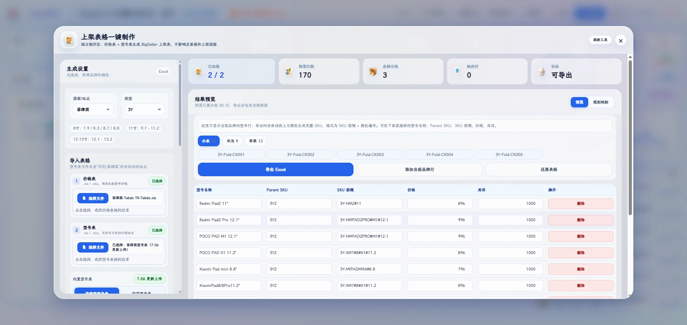
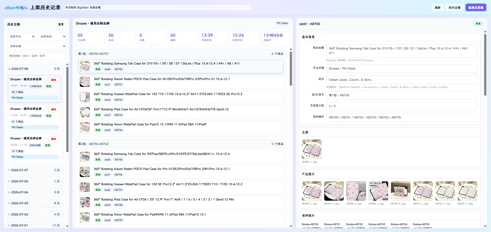

## 项目定位

自动上架系统不是一个简单的“点按钮脚本”，而是一套面向跨境电商运营场景设计的批量发布中枢。它把 Excel 表格、产品图库、视频素材、AI 标题生成、BigSeller 页面操作、店铺状态确认和运行历史记录串成一条完整链路，让重复、易错、耗时的上架工作变成可配置、可监控、可复盘的产品化流程。

目前系统已经落地到两个核心店铺/平台方向：Shopee 和 TikTok Shop。它们分别拥有独立 Worker、独立运行状态、独立日志和发布策略，能够针对不同平台的页面结构、编辑入口、保存逻辑和成功判定做定制处理。这个基础非常重要，因为真正的电商自动化从来不是“一套流程跑天下”，而是要让每个平台的差异被系统吸收，让运营人员面对的是统一、稳定、清晰的控制台。

## 已实现能力

系统当前以 BigSeller 为核心操作入口，通过内置 Chromium 与 Playwright 自动化完成商品编辑、素材上传、标题生成、变体校验和最终发布。运营人员只需要准备表格和素材，系统就能按照预设模板把复杂步骤拆解执行。

它已经覆盖了批量上架中最容易出错的环节：自动搜索商品、进入编辑页、删除旧图、上传主图和详情图、上传视频、绑定变体图、生成或拼接商品标题、发布前截图留档、成功后关闭页面，并把每一次运行沉淀为历史记录。

## 模板化：把经验变成配置

平板套是当前最成熟的应用场景。系统内置了多套产品模板，例如 360 旋转壳、3Y 折叠壳、书本式保护壳、笔槽款、通用品牌模板等，并按品牌维护图片组、主图序号、变体图序号、AI 分析图片、视频策略、标题结构和机型关键词。

这意味着系统并不是把某一次上架动作写死，而是把“运营经验”沉淀成可调整的模板。今天它可以服务平板保护套，明天也可以扩展到手机壳、配件、家居小商品、数码周边、服饰配件，甚至任何存在规律化素材和规格组合的产品线。

## AI 标题：让批量发布更像精细运营

系统接入 AI 标题生成能力，可以根据图片内容和模板规则生成更适合平台展示的英文标题。它不仅能做固定标题拼接，也支持 AI 分析图片、随机重排品牌和机型关键词、按平台字符限制控制输出。

这部分的价值不只是“省时间”，更重要的是让批量上架保持足够的内容差异和商品表达质量。对高 SKU、高频发布的跨境店铺来说，标题质量、关键词覆盖和可读性会直接影响商品点击、搜索曝光和后续转化。

## 运行可视化：自动化必须可控

一个高端自动化产品，不能只追求“跑得快”，还要让人知道它正在做什么、做到哪里、哪里可能有风险。这个系统提供实时日志、运行状态、暂停/恢复、店铺信息确认、截图留档、历史记录和 Token 消耗监控。

当任务进入高风险步骤，例如上传素材、匹配变体、发布商品之前，系统会保留关键过程信息，让运营人员可以追踪问题，而不是等任务失败后只看到一个模糊结果。

## 双平台基础：Shopee 与 TikTok Shop

目前已经实现的两个店铺/平台方向是 Shopee 和 TikTok Shop。Shopee 侧更强调 BigSeller 商品列表、编辑页、素材上传和“保存并发布”的完整链路；TikTok Shop 侧则针对 TK 页面入口、表格起始行、编辑按钮、更新按钮和成功判断做了独立适配。

两条链路共用系统级能力，例如配置中心、内置浏览器、素材管理、历史记录、截图、AI 标题、SSE 日志流，同时保留平台差异化逻辑。这种设计让后续扩展更自然：新增平台不需要推倒重来，而是在统一底座上接入新的 Worker、页面策略和模板规则。

## 周边工具：从上架延伸到运营维护

围绕上架主流程，系统还加入了批量上传表格、批量添加新型号、批量开启折扣、清空素材中心、视频中心、截图中心、历史海报等工具。这些功能看起来像“小工具”，实际是电商运营每天都会碰到的高频维护动作。

把这些动作统一在同一个系统里，能够减少来回切换工具、手动复制路径、重复打开页面带来的损耗，也让自动化从“单点功能”升级成“运营工作台”。

## 可定制方向

这套系统最有价值的地方，是它具备继续定制的空间。平板套只是第一个成熟行业模板，未来可以沿着三个方向继续升级。

第一是产品线定制。不同品类的 SKU 结构、图片规则、标题逻辑和规格字段不同，系统可以为手机壳、耳机配件、电脑包、服饰配件、家居百货等产品建立独立模板，把每个行业的上架经验沉淀成可复用模块。

第二是平台定制。除了 Shopee 和 TikTok Shop，后续可以继续接入 Lazada、Tokopedia、Shopify、WooCommerce、Amazon Seller、Temu 或本地化 ERP 后台。平台变化并不影响系统的核心价值：统一素材、统一配置、统一状态、统一历史，再用平台适配层处理差异。

第三是运营策略定制。未来可以继续加入标题 A/B 策略、价格与库存联动、自动翻译、多语言标题、违禁词检测、图片合规检查、店铺维度权限、任务队列调度、失败重试策略和团队协作审计。

## 产品愿景

自动上架系统最终要打造的，不只是一个能替人点击页面的工具，而是一个可以交付给高强度跨境团队使用的专业产品：稳定、清晰、可扩展、可复盘，并且能跟着业务一起长大。

当平台变多、产品变多、店铺变多、素材变多，真正稀缺的不是单次操作速度，而是流程标准化能力。这个系统的方向，就是把复杂运营流程装进一个可靠的中枢里，让团队把精力放回选品、素材、定价和增长，而不是反复消耗在机械上架上。

