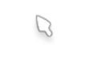

做网站时，我通常会先处理最显眼的部分：横幅、文章卡片、侧边栏、配色和字体。鼠标指针几乎总被留到最后，因为它不影响内容，也不会决定页面能不能使用。

可博客真正打开以后，鼠标又是桌面端最频繁出现的元素。它一直在页面上移动，经过导航、文章链接、播放器按钮和工具入口。默认箭头没有问题，只是和我已经重新整理过的第二代博客相比，显得过于“系统自带”。

于是这次我给它换了两枚本地光标。


## 只做两种状态就够了

我没有做跟随鼠标的粒子、拖尾或点击烟花。博客页面已经有壁纸轮播、水波纹和樱花效果，再叠一层持续运行的鼠标动画，只会增加干扰。

最终只保留两种状态：

- 普通浏览时使用默认光标；
- 遇到链接、按钮和可点击控件时切换为指针光标。

两枚 `.cur` 文件放在 `public/mouse/`，CSS 用变量统一管理：

```css
:root {
  --cursor-default: url("/mouse/default.cur"), default;
  --cursor-pointer: url("/mouse/pointer.cur"), pointer;
}
```

这里的第二个值不是多余的。如果自定义文件加载失败，浏览器仍然能回退到系统的 `default` 或 `pointer`，页面不会因此失去正确的交互提示。



## 可点击，不等于所有元素都用手型

最开始很容易写成：

```css
* {
  cursor: url("/mouse/default.cur"), default;
}
```

这样虽然省事，却会把输入框和文本区域也覆盖掉。用户准备选中文字或输入内容时，光标仍然是一枚普通箭头，反而削弱了浏览器原本清楚的提示。

所以我只给明确的交互元素使用指针光标，包括链接、按钮、下拉框、`role="button"` 和站内已有的 `.cursor-pointer`。输入框、文本域与可编辑区域继续使用系统文本光标。

这类细节很小，但它决定了自定义样式是在增强界面，还是只是在覆盖默认行为。

## 只在真正有鼠标的设备上启用

手机和平板没有悬停指针，没必要加载或应用桌面光标样式。我把规则放进了媒体查询：

```css
@media (hover: hover) and (pointer: fine) {
  /* cursor rules */
}
```

只有同时支持悬停、并且具有精确指针的设备才会启用。触屏端保持原样，也不会为了一个用不到的效果增加额外逻辑。

## 完整接入步骤

首先准备两枚 `.cur` 文件，并按下面的结构放进 `public`：

```txt
public/
└─ mouse/
   ├─ default.cur
   └─ pointer.cur
```

`public` 中的文件会原样复制到构建结果，因此页面访问路径分别是 `/mouse/default.cur` 和 `/mouse/pointer.cur`。如果文件名使用中文或空格，虽然也可能访问成功，但更容易在 CSS 转义和服务器迁移时出问题。

接着新建 `src/styles/mouse.css`。下面是站内实际使用的完整规则：

```css
@media (hover: hover) and (pointer: fine) {
  :root {
    --cursor-default: url("/mouse/default.cur"), default;
    --cursor-pointer: url("/mouse/pointer.cur"), pointer;
  }

  html,
  body {
    cursor: var(--cursor-default);
  }

  a,
  button,
  select,
  label,
  summary,
  [role="button"],
  [role="link"],
  .cursor-pointer,
  input[type="button"],
  input[type="submit"],
  input[type="reset"] {
    cursor: var(--cursor-pointer);
  }

  input,
  textarea,
  [contenteditable="true"] {
    cursor: text;
  }
}
```

最后在全局布局 `src/layouts/Layout.astro` 的 frontmatter 中导入：

```ts
import "@/styles/main.css"
import "@/styles/variables.styl"
import "@/styles/markdown-extend.styl"
import "@/styles/mouse.css"
```

这一步必须放在全局布局，而不是某个单独页面。否则首页可能已经换了光标，进入文章页后又恢复系统样式。

## 怎样确认文件真的生效

构建成功只代表 CSS 语法没错，不代表 `.cur` 一定可以读取。可以直接在浏览器打开：

```txt
http://127.0.0.1:4321/mouse/default.cur
http://127.0.0.1:4321/mouse/pointer.cur
```

再打开开发者工具，检查 `body` 的计算样式中是否出现自定义 URL。鼠标移到链接上时，计算结果应切换到 `pointer.cur`；移到正文段落时回到 `default.cur`；进入输入框时仍然是文本光标。

如果浏览器完全没有变化，优先排查：

1. 文件实际下载成了 HTML 错误页，而不是 CUR 二进制文件；
2. CSS 写的是相对路径，进入二级路由后找不到文件；
3. 光标尺寸或格式不被当前浏览器支持；
4. 设备被媒体查询识别为触屏设备。

我最终使用绝对路径，并给每条规则都保留系统回退值。这样就算某个浏览器不支持自定义文件，交互语义也不会丢失。

## 越小的改动，越应该克制

自定义光标的代码量很少，真正需要判断的是它应该影响哪些地方。

如果把它做得太抢眼，鼠标每移动一次都在提醒访客“这里换过皮肤”，阅读就会被打断。现在这版更像一个不主动解释的彩蛋：不仔细看可能不会立刻发现，可一旦注意到，会知道这个网站连最小的交互状态也经过了选择。

第二代博客对我来说不是一个急着堆满功能的展示站。它可以有个性，但个性不一定都要大声出现。有些只需要跟着鼠标，安静地待在每一次点击之前。
