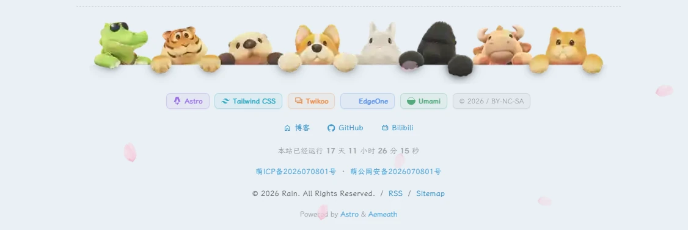

以前我很少认真看页脚。

搭建第一代博客时，我把它当成页面最后的一行版权文字：写上年份、站点名称，再放一个 RSS 链接，任务就算结束。后来文章越来越多，导航、侧栏、播放器和各种小组件陆续长出来，我才发现页脚其实是读者离开一篇文章之前，最后一次和站点发生关系的地方。

它不适合塞满所有信息，却应该把最需要被记住的内容交代清楚：这个站点用了什么、作者还维护哪些入口、网站运行了多久、版权和备案信息应该去哪里确认。于是这次我没有继续往原来的 FooterConfig.html 里堆标签，而是把页脚重新拆成几个有明确职责的区域。

## 先确定页脚的内容顺序

我最后采用了下面这条从“氛围”到“信息”的顺序：

1. 一条轻量的装饰带，让正文和页脚之间有一个缓冲。
2. 技术徽章，说明站点由哪些工具组成。
3. 社交链接，只保留博客、GitHub、Bilibili 三个入口。
4. 运行时间，把“这个站点还活着”变成一个持续变化的数字。
5. 备案提示和版权信息，放在页面最底部，方便查找但不抢视线。

这个顺序有一个很实际的好处：访客先看到站点气质，再看到可继续访问的入口，最后才是法律和版权信息。每一层都很短，手机上也不会变成一堵文字墙。

## Astro 组件应该负责什么

我把页脚放在 `src/components/layout/Footer.astro`，让它只处理三类事情：

- 在服务端输出稳定的静态内容，例如徽章、链接和版权年份；
- 计算站点运行时间的初始值，避免页面加载时出现空白；
- 在浏览器端每秒更新一次运行时间，其余内容不依赖 JavaScript。

这种拆分比把全部 HTML 放到配置文件里更容易维护。以后要调整颜色和间距，只改组件的样式；要换社交链接，只改 `socials` 数组；要修改起始日期，则改站点配置，不需要在多个文件里搜索日期字符串。

## 用数据数组控制技术徽章

徽章不是为了炫技，所以我没有给每个徽章引入一套很重的图标。当前只显示技术名称，并用不同的低饱和色做区分：

```ts
const techStack = [
  { label: "Astro", tone: "violet" },
  { label: "Tailwind CSS", tone: "cyan" },
  { label: "Twikoo", tone: "orange" },
  { label: "EdgeOne", tone: "blue" },
  { label: "Umami", tone: "green" },
];
```

渲染时只需要遍历数组：

```astro
<div class="stack-row">
  {techStack.map((item) => (
    <span class={`stack-badge ${item.tone}`}>{item.label}</span>
  ))}
</div>
```

这样做有两个好处。第一，增删技术栈不会复制粘贴一大段 HTML；第二，颜色属于 `tone`，内容和视觉样式彼此独立。将来如果我把评论系统换掉，只需要替换一项数据。

## 社交链接要设置“允许列表”

之前的个人资料里还保留了微信和邮箱入口，但这次页脚只放三个链接：博客、GitHub、Bilibili。这里我用了一个明确的数组，而不是把所有 profile links 原样输出：

```ts
const socials = [
  { name: "博客", icon: "material-symbols:home-outline", url: "https://rainzt.cn/" },
  { name: "GitHub", icon: "simple-icons:github", url: "https://github.com/Jarvis0227" },
  { name: "Bilibili", icon: "simple-icons:bilibili", url: "https://space.bilibili.com/473321504" },
];
```

这相当于给页脚加了一层“允许列表”。个人资料以后可以继续保存私密或备用联系方式，但它们不会因为配置被复用，就意外出现在公开页脚。外链统一加上 `target="_blank"` 和 `rel="noreferrer"`，避免读者离开博客后无法快速回来，也减少不必要的来源信息暴露。

## 运行时间不是一张静态图片

站点运行时间的起点写在 `siteConfig.siteStartDate`：

```ts
siteStartDate: "2026-07-08",
```

组件先在构建时计算天、小时、分钟和秒，首屏直接得到完整文字；页面加载后再用一个很小的定时器更新数字：

```ts
const seconds = Math.max(0, Math.floor((Date.now() - startAt) / 1000));
const days = Math.floor(seconds / 86400);
const hours = Math.floor((seconds % 86400) / 3600);
const minutes = Math.floor((seconds % 3600) / 60);
const secs = seconds % 60;
```

这里特意保留了 `Math.max(0, ...)`。如果服务器时间比起始日期还早，页面不会显示负数；如果以后修改起始日期，也不会让运行时间脚本直接失效。数字使用等宽数字，秒数跳动时文本宽度不会来回抖动。

## “萌备案”要和真实备案区分开

我在页脚里放了两条萌系占位文字：

```text
萌ICP备2026070801号
萌公网安备2026070801号
```

它们只是页面气氛的一部分，不是真实备案号。实际备案完成后，应该把文字和链接替换成工信部、公安备案平台提供的正式信息，不能把占位文字当作真实备案展示。这个区分也写进了我的维护笔记，避免未来换服务器或提交备案时忘记修改。

## CSS 重点是“收住”

页脚最容易出现的问题不是不好看，而是太用力。我的处理方式有三点：

- 用 `max-width` 限制内容宽度，让信息集中在正文附近；
- 用 `gap` 和 `flex-wrap` 排列徽章与链接，不写死每一行的长度；
- 颜色使用 `color-mix` 混合当前文字色，让浅色和深色主题自动保持一致。

徽章采用圆角胶囊，但边框和背景都非常淡；鼠标悬停时只向上移动一像素，不再叠加发光、缩放或大面积渐变。页脚应该像一本书的版权页，能被看见，但不应该抢走文章结尾的注意力。

响应式部分只做必要的调整：小屏幕缩短两侧装饰线、缩小徽章字号、让所有行自动换行。没有给移动端单独复制一套模板，所以桌面和手机看到的是同一份信息，维护成本也更低。

## 如何验证它真的工作

完成代码后，我会按下面顺序检查：

1. 执行 `npm.cmd run build`，确认 Astro 内容图片、图标和页面路由都能通过构建。
2. 打开文章页面滚动到底部，检查页脚是否完整出现。
3. 等待十秒，确认运行时间的秒数持续变化。
4. 逐个点击博客、GitHub、Bilibili，确认没有多余的微信或邮箱入口。
5. 调整浏览器宽度，检查徽章和备案行是否自然换行。
6. 切换深色模式，检查文字对比度和边框是否仍然清楚。



最后这张图不是参考站点的截图，而是这次修改后我自己的页面截图。把它放进文章里，一方面是给以后回顾留下一个版本快照，另一方面也能在页脚样式再次调整后，快速对比哪些细节发生了变化。

## 留给下一次改版的空间

这次我没有把页脚做成一个“功能展示区”，也没有加入访问量、天气或一长串友情链接。它现在只承担站点身份、联系入口和基础信息三件事。以后如果博客真的需要新增内容，我会优先考虑两种方式：

- 把内容加进现有的数据数组，让它继续保持可维护的结构；
- 新增一个独立的、可关闭的区域，而不是把所有东西挤进同一行。

对我来说，第二代博客最重要的变化，就是不再把每个角落都当成产品橱窗。页脚也是如此：它可以有一点可爱、有一点技术感，但最后还是要安静地把一段路送到终点。
