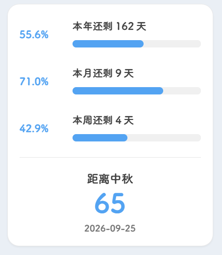

做定制项目的时候，时间通常以交付日期存在：还有几天要上线，今天必须完成哪一部分，下一轮反馈什么时候回来。

项目告一段落以后，我想在博客里放一种没那么紧张的时间提醒。它不催我完成任务，只把一年、一个月和一周走到哪里，用三条进度条安静地显示出来。



## 三条进度，代表三种尺度

组件放在右侧栏，依次显示：

- 本年已经过去的比例，以及还剩多少天；
- 本月已经过去的比例，以及还剩多少天；
- 本周已经走到哪一天，以及周末前还剩多少天。

下方再单独留一块区域，显示距离下一个节日还有多久。最初这里只保留元旦、劳动节和国庆节，结果到了 2026 年 7 月，组件直接把“下一站”指向了国庆节，漏掉了 9 月 25 日的中秋节。

现在的节日表分成三类：

- 国内节日与纪念日，例如春节、清明、劳动节、国庆节；
- 农历传统节日，例如元宵、端午、七夕、中秋、重阳和除夕；
- 常见国际节日，例如情人节、复活节、母亲节、父亲节、万圣夜、感恩节和圣诞节。

这样做以后，“全面”不再等于堆一串当年日期。公历固定节日、按星期计算的节日和农历节日分别使用不同算法，第二年仍然能够继续工作。

## 日期计算最怕看起来差不多

本月进度最简单：获取今天是几号，再除以当月总天数。

本年进度需要考虑闰年：

```ts
const daysInYear =
  (year % 4 === 0 && year % 100 !== 0) || year % 400 === 0
    ? 366
    : 365
```

周进度则要处理 JavaScript 中星期日等于 `0` 的情况。我把星期一到星期日统一映射成 `1` 到 `7`，这样进度条和“还剩几天”的文案更直观。

另一个容易忽略的问题是夏令时。直接用两个本地时间相减，在采用夏令时的地区可能遇到一天不是完整 24 小时的情况。计算天数时，我先把年月日转换到 UTC 的零点，再用毫秒差换算，避免时区偏移让倒计时多一天或少一天。

## 不需要每秒重新计算

这块组件展示的最小单位是“天”，没有必要像时钟一样每秒甚至每分钟更新。

页面加载时计算一次，然后只安排一个定时任务，等到下一个本地零点重新刷新。组件被移除时，定时器也会清理：

```ts
connectedCallback() {
  this.update()
  this.scheduleMidnightUpdate()
}

disconnectedCallback() {
  clearTimeout(this.midnightTimer)
}
```

这种写法对 Firefly 的无刷新页面切换更友好。它不会因为在首页和文章页之间来回跳转，就留下越来越多的后台任务。

## 组件结构与进度条样式

组件文件为：

```txt
src/components/widget/ScheduleProgress.astro
```

每一行由百分比、说明文字和进度轨道组成：

```astro
<div class="progress-row" data-kind="year">
  <span class="progress-percent">--%</span>
  <div class="progress-detail">
    <span class="progress-copy">本年还剩 -- 天</span>
    <div class="progress-track">
      <i></i>
    </div>
  </div>
</div>
```

我没有直接使用原生 `<progress>`，而是用普通元素控制宽度。这样渐变、发光和过渡动画更容易统一：

```css
.progress-track {
  height: 0.42rem;
  overflow: hidden;
  border-radius: 999px;
  background: var(--btn-regular-bg);
}

.progress-track i {
  display: block;
  width: 0;
  height: 100%;
  border-radius: inherit;
  background: linear-gradient(90deg, #8de6d1, var(--primary));
  transition: width 650ms cubic-bezier(0.22, 1, 0.36, 1);
}
```

脚本更新时只需要修改文字与 `width`：

```ts
private setProgress(kind: string, percent: number, copy: string) {
  const row = this.querySelector(
    `.progress-row[data-kind="${kind}"]`,
  )

  row.querySelector(".progress-percent").textContent =
    `${percent.toFixed(1)}%`
  row.querySelector(".progress-copy").textContent = copy
  row.querySelector(".progress-track i").style.width =
    `${Math.min(percent, 100)}%`
}
```

## 计算年、月、周进度

核心更新函数可以按下面的顺序组织：

```ts
const now = new Date()
const year = now.getFullYear()
const month = now.getMonth()
const today = now.getDate()

const daysInMonth = new Date(year, month + 1, 0).getDate()
const weekday = now.getDay() || 7

const startOfYear = new Date(year, 0, 1)
const startOfToday = new Date(year, month, today)
const dayOfYear =
  Math.floor((startOfToday.getTime() - startOfYear.getTime()) / 86400000) + 1
```

再分别传给 `setProgress`：

```ts
this.setProgress(
  "month",
  (today / daysInMonth) * 100,
  `本月还剩 ${daysInMonth - today} 天`,
)

this.setProgress(
  "week",
  (weekday / 7) * 100,
  `本周还剩 ${7 - weekday} 天`,
)
```

## 三类节日要用三种算法

固定公历日期最直接，月份仍然从 `0` 开始：

```ts
const fixedFestivals = [
  { name: "元旦", month: 0, day: 1, kind: "国内" },
  { name: "情人节", month: 1, day: 14, kind: "国际" },
  { name: "国庆节", month: 9, day: 1, kind: "国内" },
  { name: "圣诞节", month: 11, day: 25, kind: "国际" },
]
```

母亲节、父亲节和感恩节不是固定几号，而是“某月第几个星期几”。我写了一个通用函数：

```ts
function nthWeekdayOfMonth(
  year: number,
  month: number,
  weekday: number,
  nth: number,
) {
  const first = new Date(year, month, 1)
  const offset = (weekday - first.getDay() + 7) % 7
  return new Date(year, month, 1 + offset + (nth - 1) * 7)
}

const mothersDay = nthWeekdayOfMonth(year, 4, 0, 2)
const thanksgiving = nthWeekdayOfMonth(year, 10, 4, 4)
```

上面的 `0` 代表星期日，`4` 代表星期四。复活节的规则更特殊，组件使用 Gregorian computus 算法单独计算。

农历节日没有硬编码成 2026 年的公历日期，而是借助浏览器自带的中文农历日历：

```ts
const lunarFormatter = new Intl.DateTimeFormat(
  "zh-CN-u-ca-chinese",
  { month: "numeric", day: "numeric" },
)

function getLunarMonthDay(date: Date) {
  const parts = lunarFormatter.formatToParts(date)
  return {
    month: Number(parts.find(part => part.type === "month")?.value),
    day: Number(parts.find(part => part.type === "day")?.value),
  }
}
```

脚本从今天开始向后扫描 400 天，将每天转换成农历月日，再和节日表匹配。这样中秋始终匹配农历八月十五，端午始终匹配五月初五，不需要每年手动改日期。除夕不能写死为腊月三十，因为有些年份腊月只有二十九天；我的判断方式是检查“明天是否为正月初一”，如果是，今天就是除夕。

最后把三类候选日期合并、去重并排序，取第一个不早于今天的日期：

```ts
return [...unique.values()]
  .filter(festival => festival.date >= startOfToday)
  .sort((a, b) => a.date.getTime() - b.date.getTime())[0]
```

2026 年 7 月 24 日之后，完整列表会先显示 8 月 19 日的七夕节，随后是 9 月 25 日的中秋节，不会再直接跳到国庆节。

## 注册并放到右侧最下面

与其他侧栏组件一样，需要完成三步：

1. 在 `WidgetComponentType` 中加入 `"scheduleProgress"`；
2. 在 `SideBar.astro` 导入组件并写入 `componentMap`；
3. 在 `rightComponents` 最后加入配置。

```ts
{
  type: "scheduleProgress",
  enable: true,
  position: "sticky",
  showOnPostPage: false,
}
```

它被放在右侧配置最后，因此会出现在日历与其他启用组件之后。`position: "sticky"` 让它属于跟随滚动区域；如果改成 `top`，它会和时钟、统计等固定顶部组件排在一起。

测试时重点看月末、年末、星期日和闰年二月。日期组件最容易在边界条件出错，普通工作日显示正确并不能说明算法已经完整。

## 进度条不是为了制造焦虑

把时间做成百分比，很容易让人产生“今年怎么已经过去这么多”的紧迫感。所以我没有使用警告色，也没有加入“剩余生命”一类过重的文案。

三条进度都沿用博客主题色，数字保持小尺寸，下方倒计时只写“距离下一站”。它更像一个路标，而不是考核表。

有时我会觉得时间很快，电脑里的项目文件夹一批接一批，回过头才发现一个月已经接近尾声。把这些尺度放在侧边栏，至少能让我在打开博客时短暂地意识到：今天属于这一周，也属于这个月和这一年。

工具提醒我把工作做完，进度条则提醒我，时间本身也值得被看见。
