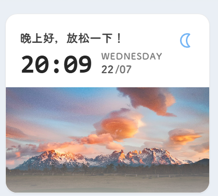

最近重新打磨第二代博客时，我开始留意一些并不影响功能，却会影响“这个网站像不像自己”的小地方。

侧边栏原本放着站点统计、日历和音乐播放器，它们各自都很实用，但少了一点会随时间发生变化的东西。于是我加了一块实时时钟：早晨说早上好，中午提醒吃饭和休息，到了晚上则让页面的语气慢下来。



这项改动看上去只是多了几行时间和一句问候，真正做起来却经历了一次很明显的返工。

## 第一版，做得太像一张海报

最初我把整张卡片都铺成鸣潮壁纸，在图片上叠暗色渐变，再放一个很大的时间。单独看并不难看，甚至有一点游戏界面的感觉。

可它放进右侧栏以后，问题立刻出现了：信息层级太重，和旁边干净的白色卡片不在同一个体系里。用户第一眼看到的是背景图，而不是时间；卡片像一个缩小的横幅，而不是侧栏部件。

这次偏差也提醒了我，参考一个效果时不能只识别“它有哪些元素”，还要识别这些元素之间的关系。原版真正舒服的地方，是上半部分把问候、时间、星期和日期排得很克制，下半部分才留给图片。它不是在图片上写字，而是把信息和装饰分成了两个区域。

所以第二版我把结构彻底拆开：

- 上半部分使用博客卡片原有的浅色背景；
- 时间保持最大字号，问候语放在它上方；
- 星期和日期缩小后靠在时间右侧；
- 右上角只留一个跟随时段变化的小图标；
- 底部固定为横向图片区域。

这样放回右侧栏后，它终于像这个博客原本就有的一部分。

## 图片必须是我的鸣潮图库

版式稳定后，我又改了两次图片逻辑。

第一次为了加载速度，直接用了壁纸目录里的缩略图。卡片只有 280 像素宽，看起来似乎够用，但缩略图经过压缩后再裁切，人物细节明显发糊。最后还是换回同一批鸣潮壁纸的原图，让浏览器按卡片尺寸裁切显示。

图片池只读取站内已经整理好的鸣潮壁纸：

```ts
const images = [
  "wallpaper-01.webp",
  "wallpaper-25.webp",
  // ...
  "wallpaper-47.webp",
]
```

每次刷新会重新随机选择一张。这样它不会请求第三方随机图接口，也不会突然出现和站点风格无关的风景照。页面横幅、相册和时钟卡片使用的是同一套视觉素材，整个网站的气质更统一。

## 时间更新不能留下重复计时器

Firefly 有无刷新页面切换。如果直接在脚本里写一个全局 `setInterval`，组件被替换后计时器可能仍然活着，来回切几次页面就会出现多个任务同时更新。

我把它做成了自定义元素，在组件挂载时启动，在移除时清理：

```ts
connectedCallback() {
  this.updateGreeting()
  this.alignToNextMinute()
}

disconnectedCallback() {
  clearInterval(this.minuteTimer)
  clearTimeout(this.alignmentTimer)
}
```

第一次更新会对齐到下一分钟的边界，之后每分钟刷新一次。这样时间不会因为页面打开的秒数不同而慢慢偏移，也能适应站内的页面切换。

问候语按六个时段划分：

- 深夜：提醒早点休息；
- 早晨：迎接新的一天；
- 上午：保持活力；
- 中午：记得午休；
- 下午：继续加油；
- 晚上：适当放松。

## 从零接入这个组件

如果要在同一套 Firefly 项目里复现，主要改动四个文件：

```txt
src/components/widget/TimeGreeting.astro
src/components/layout/SideBar.astro
src/types/sidebarConfig.ts
src/config/sidebarConfig.ts
```

先建立 `TimeGreeting.astro`。组件上半部分负责信息，下半部分负责图片：

```astro
<time-greeting-widget class:list={["time-greeting-card card-base", className]}>
  <div class="time-greeting-info">
    <div>
      <p class="time-greeting-message">正在获取时间...</p>
      <div class="time-greeting-meta">
        <time class="time-greeting-clock">--:--</time>
        <div class="time-greeting-date">
          <span class="time-greeting-week">---</span>
          <div>
            <span class="time-greeting-day">--</span>
            <span class="time-greeting-month">/--</span>
          </div>
        </div>
      </div>
    </div>
  </div>
  <div class="time-greeting-image"></div>
</time-greeting-widget>
```

时段判断独立成函数，后续改文案时不需要碰 DOM 更新逻辑：

```ts
function getGreetingPeriod(hour: number) {
  if (hour < 6) return { id: "late-night", message: "夜深了，早点休息！" }
  if (hour < 9) return { id: "morning", message: "早上好，新的一天！" }
  if (hour < 12) return { id: "forenoon", message: "上午好，充满活力！" }
  if (hour < 14) return { id: "noon", message: "中午好，记得午休！" }
  if (hour < 18) return { id: "afternoon", message: "下午好，继续加油！" }
  return { id: "evening", message: "晚上好，放松一下！" }
}
```

鸣潮图片池不必手写二十多个完整路径，可以用编号生成：

```ts
const images = [
  "01",
  ...Array.from({ length: 23 }, (_, index) =>
    String(index + 25).padStart(2, "0"),
  ),
].map(index => `/assets/images/wallpaper/wallpaper-${index}.webp`)

const imageUrl = images[Math.floor(Math.random() * images.length)]
```

先用 `new Image()` 预加载，成功后再设置 CSS 变量，可以避免图片下载过程中卡片突然闪白：

```ts
const image = new Image()
image.onload = () => {
  this.style.setProperty("--time-greeting-image", `url("${imageUrl}")`)
  this.dataset.imageReady = "true"
}
image.src = imageUrl
```

CSS 中让图片区读取这个变量：

```css
.time-greeting-image {
  height: 9rem;
  background-image: var(--time-greeting-image);
  background-position: center;
  background-size: cover;
  opacity: 0;
  transition: opacity 650ms ease;
}

time-greeting-widget[data-image-ready="true"] .time-greeting-image {
  opacity: 1;
}
```

组件完成后，在 `SideBar.astro` 导入并加入映射：

```ts
import TimeGreeting from "@/components/widget/TimeGreeting.astro"

const componentMap = {
  // 其他组件
  timeGreeting: TimeGreeting,
}
```

然后在 `sidebarConfig.ts` 的右侧栏中启用：

```ts
{
  type: "timeGreeting",
  enable: true,
  position: "top",
  showOnPostPage: false,
}
```

最后别忘了把 `"timeGreeting"` 加进 `WidgetComponentType` 联合类型，否则 TypeScript 会在构建时提示配置值不合法。

本地执行 `npm run build` 后，至少检查三种情况：刷新页面时图片是否变化；停留到下一分钟时数字是否更新；从首页进入文章页后组件是否按配置隐藏。只看静态截图并不能证明定时器与无刷新切页都正常。

## 小组件也需要服从整体

这次改造最有价值的部分，并不是写出了一个时钟，而是把一版“看起来挺酷”的方案主动推倒。

个人博客很容易不断往里加效果。可每一个效果都在争夺注意力，如果只追求单独截图好看，最后页面反而会越来越吵。现在这块时钟保留了鸣潮图片、分时图标和实时变化，也仍然愿意退回到侧栏应有的位置。

它每天会说不同的话，每次刷新会换一张图，但不会压过文章本身。对我来说，这才是这类小组件最合适的状态。
