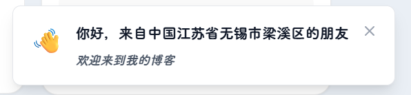

很多个人博客会在访客进入时弹出提示。有的展示浏览器和操作系统，有的显示 IP、天气和访问次数，也有的连续弹出好几条通知。

我喜欢“有人来时说一句欢迎”这个想法，却不希望它变成开门后的第一道障碍。于是这次做的欢迎提示很轻：只在同一浏览会话第一次打开网站时出现，从右下角进入，停留几秒后自己离开。



## 欢迎应该出现一次，而不是每页一次

Firefly 在站内跳转时会替换页面内容。如果每次切换路由都重新执行欢迎逻辑，访客从首页打开文章、再去工具页，会连续看到同一条提示。

我使用 `sessionStorage` 保存一个会话标记：

```ts
const key = "rain_welcome_seen_v1"

if (sessionStorage.getItem(key)) return
sessionStorage.setItem(key, "true")
```

只要当前标签页没有关闭，它就不会再次出现。重新打开一个新会话时，欢迎提示才会回来。

我没有使用长期的 `localStorage`，因为那会让看过一次的访客以后永远见不到；也没有使用 Cookie，因为这个状态只和页面体验有关，不需要发给服务器。

## 先显示，再尝试获取所在地

提示出现时，会先根据本地时间生成一句问候：

- 早晨显示“早上好”；
- 下午显示“下午好”；
- 深夜则把语气放轻。

随后才在后台请求所在地。如果接口顺利返回，文案会补充为“来自某地的朋友，很高兴遇见你”；如果请求超时、被浏览器拦截或接口暂时不可用，就保留普通欢迎语。

这一步的顺序很重要。第三方接口不应该决定组件能不能出现，更不能拖慢博客正文。请求设置了较短超时，并且使用 `AbortController` 主动终止。定位只是锦上添花，失败不是页面错误。

## 动画要让人看见，也要允许离开

弹窗使用位移、缩放和透明度完成进入动画，时间控制得比较短。右上角保留关闭按钮，不要求访客一定等自动计时结束。

在手机上，它会避开底部悬浮导航；如果系统开启“减少动态效果”，位移动画会被取消，只做轻微淡入淡出。

这些处理看起来比“显示一段文字”复杂，但它们共同决定了提示会不会打扰人：

- 不遮挡主要按钮；
- 不抢占页面焦点；
- 可以手动关闭；
- 几秒后自动消失；
- 同一会话不重复；
- 接口失败不报错。

## 建立欢迎提示组件

组件放在：

```txt
src/components/features/WelcomeToast.astro
```

它不是侧栏内容，而是覆盖在页面右下角，所以直接写成全局功能组件：

```astro
<welcome-toast
  class="welcome-toast"
  aria-live="polite"
  aria-atomic="true"
  data-state="idle"
>
  <div class="welcome-toast-icon">✦</div>
  <div>
    <span class="welcome-toast-kicker">WELCOME</span>
    <strong class="welcome-toast-title">欢迎来到朝朝听雨</strong>
    <p class="welcome-toast-message">很高兴在这里遇见你。</p>
  </div>
  <button class="welcome-toast-close" aria-label="关闭欢迎提示">×</button>
</welcome-toast>
```

`aria-live="polite"` 会让辅助技术在合适的时机读出提示，又不会强行打断正在阅读的内容。

显示与关闭只依赖 `data-state`：

```css
.welcome-toast {
  opacity: 0;
  pointer-events: none;
  transform: translateY(calc(100% + 2rem)) scale(0.96);
  transition:
    opacity 320ms ease,
    transform 420ms cubic-bezier(0.22, 1, 0.36, 1);
}

.welcome-toast[data-state="visible"] {
  opacity: 1;
  pointer-events: auto;
  transform: translateY(0) scale(1);
}
```

在窄屏下要给底部导航留出空间：

```css
@media (max-width: 640px) {
  .welcome-toast {
    right: 1rem;
    bottom: calc(5rem + env(safe-area-inset-bottom));
    left: 1rem;
    width: auto;
  }
}
```

## 会话判断与定位回退

初始化时先读 `sessionStorage`，没有标记才延迟显示：

```ts
connectedCallback() {
  if (sessionStorage.getItem("rain_welcome_seen_v1")) return

  this.querySelector(".welcome-toast-close")
    ?.addEventListener("click", () => this.close(), { once: true })

  this.showTimer = window.setTimeout(() => this.show(), 850)
}
```

`show()` 中先写入会话标记并显示普通欢迎语，再发起定位请求：

```ts
sessionStorage.setItem("rain_welcome_seen_v1", "true")
this.dataset.state = "visible"

const response = await fetch("https://v2.xxapi.cn/api/ip", {
  signal: this.abortController.signal,
})
```

接口返回结构可能变化，因此不要直接假设地址一定在某个字段。我的处理会依次尝试 `data.address`、`data.location`、`data.city` 等候选值。任何异常都会进入 `catch`，保留“很高兴在这里遇见你”的默认文本。

为了防止请求长时间占用，设置 3.5 秒超时：

```ts
this.abortController = new AbortController()
const timeout = window.setTimeout(
  () => this.abortController?.abort(),
  3500,
)
```

关闭组件或离开页面时，也要终止请求并清理计时器。

## 挂载到全局布局

在 `src/layouts/Layout.astro` 顶部导入：

```ts
import WelcomeToast from "@components/features/WelcomeToast.astro"
```

然后在 `body` 末尾、其他全局效果附近挂载：

```astro
<SakuraEffect />
<WelcomeToast />
<FancyboxManager />
```

测试“只出现一次”时，普通刷新不会再次显示，因为当前标签页的 `sessionStorage` 仍然存在。可以新开一个标签页，或者在开发者工具的 Application 面板中删除 `rain_welcome_seen_v1` 后再刷新。

还需要主动测试断网或接口失败的情况。一个合格的欢迎提示应该在没有定位数据时照常出现和关闭，而不是在控制台抛出未处理异常。

## 个性化不等于收集更多信息

位置欢迎很容易继续扩展：显示 IP、网络运营商、浏览器、系统版本，甚至根据天气改变文案。

我没有继续加。访客来到博客，是为了看内容，不是为了被告知网站识别出了多少信息。现在只使用接口返回的概略地区来组织一句话，获取不到就立刻退回普通欢迎，并且不保存这些数据。

这也符合我对第二代博客的想法：可以有技术细节，也可以有一点个人气息，但不需要把每一种能力都展示出来。

欢迎提示最终只停留几秒。它不会成为网站里最重要的功能，却能在第一次见面时替我说一句：你好，欢迎来到朝朝听雨。
